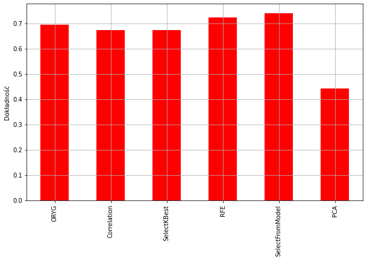
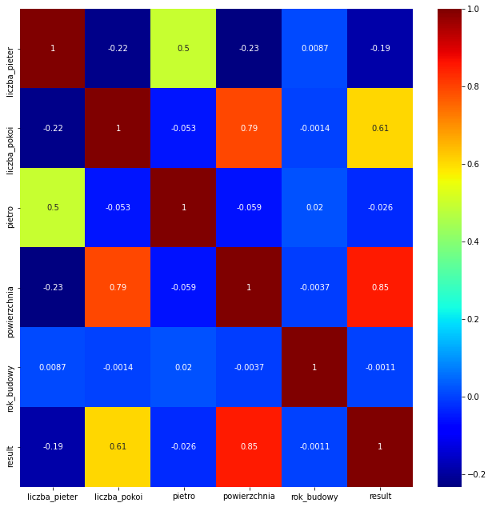

# Wybór najlepszych cech zmiennej niezależnej

Dokładność estymatora zależna jest od jakości zmiennej niezależnej. 
Nie wszystkie cechy mogą mieć znaczenie przy trenowaniu modelu. Feature engineering to technika pozwalająca wybrać najlepszy zestaw cech.

## Porównanie metod

- wybór na podstawie korelacji
- z wykorzystaniem klasy SelectKBest
- technika RFE
- z wykorzystaniem klasy SelectBestModel
- PCA

Korelacja pomiędzy cechami a zm. zależną

